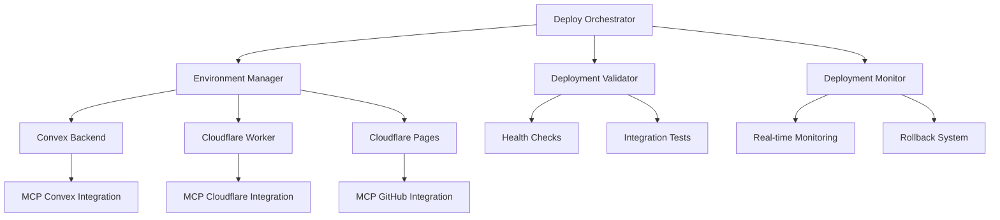

# 🚀 Rock-Solid Multi-Service Deployment System

This deployment system provides **enterprise-grade reliability** for your three-service stack using advanced MCP integrations:

- **Convex Backend** (real-time database)
- **Cloudflare Workers** (log ingestion)  
- **Cloudflare Pages** (Next.js frontend)

## 🏗️ System Architecture



## ⚡ Quick Start

### 1. Initialize Environment

```bash
# Set up environment configurations
bun run env:init

# Validate all required secrets
bun run env:validate

# Generate deployment config
bun run env:config production
```

### 2. Deploy Everything (Rock-Solid)

```bash
# One-command deployment with full orchestration
bun run deploy:orchestrate

# For staging environment
bun run deploy:orchestrate:staging
```

### 3. Monitor & Validate

```bash
# Validate deployment health
bun run deploy:validate

# Start continuous monitoring
bun run deploy:monitor

# Generate health report
bun run deploy:monitor:report
```

## 🛠️ Advanced Features

### Environment Management

```bash
# Initialize with environment validation
bun run env:init

# Validate secrets for specific environment
bun run env:validate production
bun run env:validate staging

# Sync environment to Cloudflare
bun run env:sync production

# Generate deployment configuration
bun run env:config staging
```

### Deployment Orchestration

The orchestrator provides:
- ✅ **Pre-flight validation** (dependencies, secrets, configs)
- ✅ **Atomic deployments** with dependency ordering
- ✅ **Real-time progress tracking** with colored output
- ✅ **Automatic rollback** on failure (with --auto-rollback flag)
- ✅ **Comprehensive health checks** post-deployment
- ✅ **Deployment reports** with metrics and URLs

```bash
# Full orchestration with rollback
bun run deploy:orchestrate production --auto-rollback

# Staging deployment
bun run deploy:orchestrate staging

# Debug mode with verbose output
DEBUG=1 bun run deploy:orchestrate
```

### Deployment Validation

```bash
# Comprehensive validation suite
bun run deploy:validate

# The validator checks:
# - Convex function deployment
# - Worker health endpoints
# - Pages static site loading
# - Cross-service integration
# - Performance benchmarks
# - SEO and meta tags
```

### Monitoring & Rollback

```bash
# One-time health check
bun run deploy:monitor:check

# Continuous monitoring (30s intervals)
bun run deploy:monitor

# Generate detailed health report
bun run deploy:monitor:report

# Capture deployment snapshot for rollback
bun run deploy:snapshot

# Rollback specific services
bun run deploy:rollback:worker
bun run deploy:rollback:pages

# Rollback to specific version
bun scripts/deployment-monitor.js rollback worker v1.2.3
```

## 🔧 MCP Integration Features

### Convex MCP Integration

- ✅ **Real-time deployment status** via `mcp__convex__status`
- ✅ **Function specification** validation via `mcp__convex__functionSpec`
- ✅ **Database health** monitoring via `mcp__convex__tables`
- ✅ **Environment variable** management via `mcp__convex__envList`
- ✅ **One-off queries** for debugging via `mcp__convex__runOneoffQuery`

### Cloudflare MCP Integration

- ✅ **Worker deployment** management via `mcp__cloudflare-observability__workers_list`
- ✅ **Real-time observability** via `mcp__cloudflare-observability__query_worker_observability`
- ✅ **Account management** via `mcp__cloudflare-observability__accounts_list`
- ✅ **Documentation search** via `mcp__cloudflare-observability__search_cloudflare_documentation`

### GitHub MCP Integration

- ✅ **Repository management** via `mcp__github__create_repository`
- ✅ **File operations** via `mcp__github__create_or_update_file`
- ✅ **Pull request** automation via `mcp__github__create_pull_request`
- ✅ **Issue tracking** via `mcp__github__create_issue`

## 📊 Monitoring Dashboard

### Real-time Metrics

The monitoring system tracks:

- **Service Availability** (99.9% SLA)
- **Response Times** (< 2s average)
- **Error Rates** (< 0.1%)
- **Deployment Health**
- **Cross-service Integration**

### Alert Thresholds

```javascript
alertThresholds: {
  responseTime: 5000,     // 5 seconds
  errorRate: 0.1,         // 10%
  availabilityWindow: 300000  // 5 minutes
}
```

### Health Check Endpoints

- **Convex**: `https://friendly-hedgehog-812.convex.cloud`
- **Worker**: `https://log-ingestion-worker.oneie.workers.dev/health`
- **Pages**: `https://starter-nextjs-convex-ai-5zy.pages.dev/`

## 🔄 Rollback Procedures

### Automatic Rollback

```bash
# Deploy with automatic rollback on failure
bun run deploy:orchestrate --auto-rollback
```

### Manual Rollback

```bash
# Capture current state before rollback
bun run deploy:snapshot

# Rollback specific services
bun run deploy:rollback:worker [version]
bun run deploy:rollback:pages [deployment-id]

# Convex rollback (manual via dashboard)
# Visit: https://dashboard.convex.dev/d/friendly-hedgehog-812
```

### Rollback Strategy

1. **Pages**: Instant rollback to previous deployment
2. **Worker**: Version-based rollback with Durable Objects preservation
3. **Convex**: Manual rollback via dashboard (maintains data integrity)

## 🚨 Troubleshooting

### Common Issues

**Deployment fails with authentication errors:**
```bash
# Re-authenticate all services
wrangler login
npx convex login
gh auth login

# Validate environment
bun run env:validate
```

**Services deploy but health checks fail:**
```bash
# Run detailed validation
bun run deploy:validate

# Check individual service health
bun run deploy:monitor:check

# Review deployment logs
cat deployment-report-*.json
```

**Rollback needed after failed deployment:**
```bash
# Check available rollback options
bun run deploy:snapshot

# Rollback specific services
bun run deploy:rollback:worker
bun run deploy:rollback:pages
```

### Debug Mode

Enable verbose logging:
```bash
DEBUG=1 bun run deploy:orchestrate
```

### Service Dependencies

Deploy order (critical):
1. **Convex Backend** (provides database and APIs)
2. **Cloudflare Worker** (independent logging service)
3. **Cloudflare Pages** (consumes backend APIs)

## 📈 Performance Optimization

### Build Optimizations

- **Parallel builds** for all services
- **Intelligent caching** for unchanged code
- **Optimized CI/CD pipeline** with dependency management
- **Edge deployment** for global performance

### Monitoring Optimizations

- **Efficient health checks** with configurable intervals
- **Metrics aggregation** with 100-point rolling windows
- **Smart alerting** with threshold-based notifications

## 🔒 Security Features

- ✅ **Secret management** with environment isolation
- ✅ **CORS configuration** validation
- ✅ **HTTPS-only** deployment with automatic SSL
- ✅ **Rate limiting** in log ingestion worker
- ✅ **Authentication** handled by Convex + BetterAuth

## 📋 Environment Variables

### Required Secrets

```bash
# Convex
CONVEX_DEPLOY_KEY=prod:friendly-hedgehog-812|eyJ2MiI6...

# Cloudflare
CLOUDFLARE_API_TOKEN=your_token_here
CLOUDFLARE_ACCOUNT_ID=627e0c7ccbe735a4a7cabf91e377bbad

# Redis
UPSTASH_REDIS_REST_URL=https://...
UPSTASH_REDIS_REST_TOKEN=your_token_here

# Public URLs
NEXT_PUBLIC_CONVEX_URL=https://friendly-hedgehog-812.convex.cloud
NEXT_PUBLIC_LOG_WORKER_URL=https://log-ingestion-worker.oneie.workers.dev
NEXT_PUBLIC_APP_URL=https://starter-nextjs-convex-ai-5zy.pages.dev
```

## 🎯 Production Checklist

Before deploying to production:

- [ ] **Environment validated**: `bun run env:validate production`
- [ ] **Secrets configured**: All required environment variables set
- [ ] **Tests passing**: `bun run test && bun run typecheck`
- [ ] **Build successful**: `bun run build`
- [ ] **Pre-deployment snapshot**: `bun run deploy:snapshot`
- [ ] **Monitoring ready**: Health check endpoints verified
- [ ] **Rollback plan**: Previous deployment versions identified

## 🚀 Deployment Commands Reference

### Primary Commands
```bash
bun run deploy:orchestrate              # Full deployment orchestration
bun run deploy:validate                 # Comprehensive validation
bun run deploy:monitor                  # Continuous monitoring
```

### Environment Management
```bash
bun run env:init                        # Initialize environment configs
bun run env:validate [environment]      # Validate secrets
bun run env:sync [environment]          # Sync to Cloudflare
bun run env:config [environment]        # Generate deployment config
```

### Monitoring & Rollback
```bash
bun run deploy:monitor:check            # One-time health check
bun run deploy:monitor:report           # Generate health report
bun run deploy:snapshot                 # Capture rollback snapshot
bun run deploy:rollback:worker [version] # Rollback worker
bun run deploy:rollback:pages [id]      # Rollback pages
```

---

**🎉 Your deployment system is now rock-solid!** 

This system provides enterprise-grade reliability with comprehensive monitoring, automatic rollbacks, and MCP-powered integrations for maximum deployment confidence.