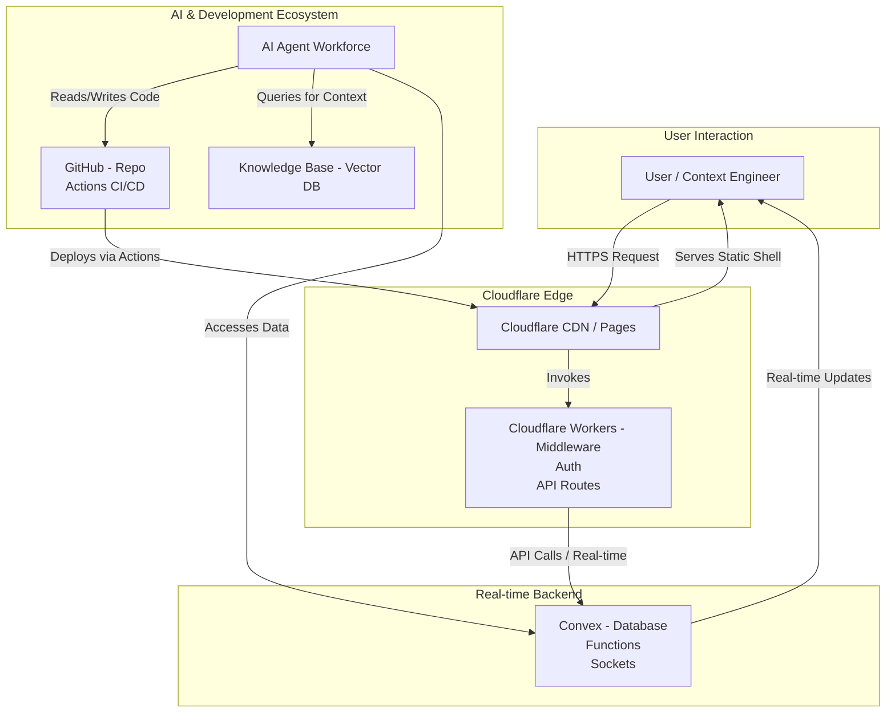

# The Agentic Starter Template Fullstack Architecture Document

| Date | Version | Description | Author |
| :--- | :--- | :--- | :--- |
| July 14, 2025 | 1.0 | Final, complete version for approval | Winston (Architect) |

## Introduction

This document outlines the complete fullstack architecture for The Agentic Starter Template, including backend systems, frontend implementation, and their integration. It serves as the single source of truth for AI-driven development, ensuring consistency across the entire technology stack.

This unified approach combines what would traditionally be separate backend and frontend architecture documents, streamlining the development process for this modern fullstack application where these concerns are deeply intertwined.

### Starter Template or Existing Project

Based on our Project Brief, this project is being built from scratch to **create** a new starter template. Therefore, no existing starter template is being used as a foundation. All tooling, configuration, and architectural patterns will be established and documented herein.

## High Level Architecture

#### **Technical Summary**

The system will be a full-stack, edge-first application built within a TypeScript monorepo. It is architected to prioritize global low-latency, exceptional developer experience, and seamless integration with a workforce of AI agents. The architecture leverages Cloudflare for hosting and edge compute, with Convex providing the real-time backend and database. This hybrid execution model ensures optimal performance and scalability, while the entire system is designed around a series of agentic feedback loops to enable self-improvement and rapid, high-quality development.

#### **Platform and Infrastructure Choice**

  * **Platform:** A combination of Cloudflare and Convex.
  * **Key Services:**
      * **Cloudflare:** Pages (for hosting), Workers (for edge compute/middleware), Vectorize DB (for RAG), R2 (for object storage), KV (for edge caching).
      * **Convex:** Real-time Database, Serverless Functions (Queries, Mutations, Actions).
  * **Deployment Host and Regions:** Cloudflare's Global Edge Network.

#### **Repository Structure**

  * **Structure:** Monorepo.
  * **Monorepo Tool:** Turborepo.
  * **Package Manager:** Bun.

#### **High Level Architecture Diagram**



#### **Architectural Patterns**

  * **Edge-First Architecture:** All user requests are first handled by Cloudflare's global edge network, ensuring minimal latency worldwide for both static assets and dynamic API calls.
  * **Hybrid Execution Model:** The architecture explicitly uses the best platform for each job: static hosting on Cloudflare Pages, server-side logic on Cloudflare Workers, and stateful, real-time operations on Convex.
  * **Agentic Feedback Loops:** The system is designed with explicit pathways for production telemetry, user feedback, and development events to be fed into a knowledge base, which AI agents use to improve the application. This is a core, foundational pattern.
  * **Repository Pattern (for Data Access):** Business logic will access data through an abstracted repository layer. This ensures a clean separation of concerns, simplifies testing, and makes the code easier for AI agents to reason about.

## Tech Stack

| Category | Technology | Version | Purpose |
| :--- | :--- | :--- | :--- |
| **Core Technologies** | Next.js | 14.2.x | Full-stack React framework for the web application. |
| | TypeScript | 5.4.x | Language for type safety and maintainability. |
| | Convex | 1.12.x | Real-time backend platform, database, and functions. |
| | Zod | 3.23.x | Schema validation and type enforcement. |
| **Platform & Hosting**| Cloudflare | N/A | Pages, Workers, R2, KV, Vectorize DB for hosting and edge services. |
| **Authentication** | BetterAuth | Latest | Authentication service with a first-party Convex adapter. |
| **UI** | ShadCN/UI & Tailwind | Latest | Accessible component library and utility-first CSS. |
| **Client State** | Zustand | 4.5.x | Minimalist state management for ephemeral UI state. |
| **Quality & Workflow**| Bun | 1.1.x | JS Runtime, Package Manager, and Test Runner. |
| | Turborepo | 2.0.x | High-performance monorepo build system. |
| | Jest & RTL | Latest | Unit and integration testing for components and logic. |
| | Playwright | Latest | End-to-end browser automation testing. |
| | ESLint & Prettier | Latest | Code linting and formatting standards. |
| | Husky & lint-staged | Latest | Git hooks to run scripts before commits. |
| | commitlint | Latest | Enforces a consistent and readable commit message format. |
| | GitHub Actions | N/A | CI/CD pipeline for build, test, and deployment. |
| **Observability** | Sentry | N/A | Frontend and backend error logging and stack traces. |
| | PostHog | N/A | Product analytics and user behavior tracking. |
| | Logflare | N/A | Real-time log ingestion, especially for Cloudflare Workers. |
| **Agentic Tooling**| Vercel AI SDK | Latest | Powers the in-app, user-facing chatbot interface and tool-calling. |
| | Claude SDK | Latest | Enables direct backend communication with Claude models. |
| | Storybook | 8.1.x | UI component workshop for isolated development. |
| **Data Seeding** | Faker.js | 8.4.x | Realistic mock data generation for testing and development. |

## Data Models

This schema is defined in DBML (Database Markup Language) and can be visualized at dbdiagram.io.

```dbml
// DBML for The Agentic Starter Template
// Generated for visualization on dbdiagram.io

Table users {
  _id id [primary key]
  name string
  email string [unique, not null]
  profile_image_url string [note: 'Optional URL for user avatar']
  role string [not null, default: '"user"']
  _creationTime timestamp
}

Table chat_sessions {
  _id id [primary key]
  user_id id [not null]
  title string [note: 'Can be auto-generated from the first message']
  _creationTime timestamp
}

Table chat_messages {
  _id id [primary key]
  session_id id [not null]
  user_id id [not null, note: 'Denormalized for easier querying of user messages']
  role string [not null, note: '"user" or "assistant"']
  content text [not null]
  _creationTime timestamp
}

Table log_entries {
  _id id [primary key]
  correlation_id string [not null]
  user_id id [note: 'Nullable, for system/agent logs']
  level string [not null, note: '"INFO", "WARN", "ERROR", "DEBUG"']
  message text [not null]
  source string [not null, note: '"client", "worker", "convex", "agent"']
  context object [note: 'Flexible field for additional structured data']
  _creationTime timestamp
}

// --- Relationships ---
Ref: users._id < chat_sessions.user_id
Ref: chat_sessions._id < chat_messages.session_id
Ref: users._id < chat_messages.user_id
Ref: users._id < log_entries.user_id
```

## API Implementation Details

### Cloudflare Worker Endpoints (OpenAPI 3.0)

This defines the strict contract for our public-facing HTTP API served by Cloudflare Workers.

```yaml
openapi: 3.0.1
info:
  title: "Agentic Starter API"
  version: "1.0.0"
servers:
  - url: "/api/v1"
components:
  securitySchemes:
    bearerAuth:
      type: http
      scheme: bearer
      bearerFormat: JWT
  schemas:
    AgentTaskRequest:
      type: object
      properties:
        taskDescription:
          type: string
          description: "A natural language description of the task for the agent."
        targetComponent:
          type: string
          description: "The component or file the task should target."
    AgentTaskResponse:
      type: object
      properties:
        taskId:
          type: string
          description: "A unique ID for the accepted task."
paths:
  /agent-task:
    post:
      summary: "Accepts a direct task for the AI agent workforce."
      security:
        - bearerAuth: []
      requestBody:
        required: true
        content:
          application/json:
            schema:
              $ref: '#/components/schemas/AgentTaskRequest'
      responses:
        '202':
          description: "Task accepted for processing."
          content:
            application/json:
              schema:
                $ref: '#/components/schemas/AgentTaskResponse'
```

### Convex Backend Functions (Signatures)

This defines the primary data API for our frontend, written as type-safe Convex function signatures.

  * **Queries:**
      * `users:getCurrentUser()`: `Query<UserProfile | null>`
      * `chat:listSessions()`: `Query<ChatSession[]>`
      * `chat:listMessages(args: { sessionId: Id<"chatSessions"> })`: `Query<ChatMessage[]>`
      * `logs:listRecentEntries(args: { limit?: number })`: `Query<LogEntry[]>`
  * **Mutations:**
      * `chat:createSession(args: { title: string })`: `Mutation<Id<"chatSessions">>`
      * `chat:sendMessage(args: { sessionId: Id<"chatSessions">, content: string })`: `Mutation<Id<"chatMessages">>`
      * `theme:updateUserTheme(args: { settings: object })`: `Mutation<void>`
  * **Actions:**
      * `agent:runRAGQuery(args: { sessionId: Id<"chatSessions">, message: string })`: `Action<void>`
      * `agent:runCodeModification(args: { taskDescription: string })`: `Action<string>`
      * `agent:seedDatabase(args: { profile: string })`: `Action<string>`

## Components

#### **Component Interaction Diagram**

```mermaid
graph TD
    subgraph "Development Environment"
        Dev[🧑‍💻 Context Engineer <br> in Claude Code] -- "Invokes" --> DevAgents[BMAD Agents <br> (Personas)]
    end

    subgraph "Live Application"
        User[👤 End User] --> WebApp[WebApp (Next.js)]
        WebApp -- "Calls Tools via Chat" --> AIToolService[AI Tool Service <br> (Vercel AI SDK)]
        WebApp -- "HTTP" --> EdgeAPI[Edge API (Workers)]
        WebApp -- "Real-time" --> ConvexBackend[Real-time Backend (Convex)]
        
        EdgeAPI --> ConvexBackend
        AIToolService -- "Queries" --> KnowledgeBase[Knowledge Base <br> (Vectorize DB)]
        AIToolService -- "Invokes" --> ClaudeAPI[Claude API]
    end

    DevAgents -- "Writes/Refactors Code for" --> LiveApplication
```

## Source Tree

```plaintext
/
├── .github/
│   └── workflows/
│       └── ci.yml           # GitHub Actions for CI/CD
├── apps/
│   ├── web/                 # The Next.js frontend application
│   ├── workers/             # Cloudflare Workers for Edge API
│   └── convex/              # Our Convex backend app
│       ├── schema.ts
│       ├── queries.ts
│       └── ...
├── packages/
│   ├── ui/                  # Our shared, reusable UI component library
│   ├── config/              # Shared configurations (ESLint, TSConfig)
│   ├── data-access/         # Implementation of the Repository Pattern
│   ├── storybook/           # The Storybook environment
│   └── shared-types/        # Shared TypeScript types
└── docs/
    └── ...
├── package.json
├── turbo.json
└── bun.lockb
```

## Infrastructure and Deployment

The project uses a pragmatic "Infrastructure from Code" approach with GitHub Actions and the Wrangler CLI managing deployments to Cloudflare. It follows a Continuous Deployment model for the `main` branch, with automatic preview deployments for every pull request. Rollbacks are handled via Cloudflare's instant rollback feature.

## Error Handling Strategy

The strategy uses custom error classes, structured JSON logging with mandatory `correlationId`s, and a combination of retry policies and circuit breakers for external API calls, all designed to make the distributed system observable and resilient.

## Coding Standards

A minimal, strict set of mandatory rules for all developers (human and AI), including mandatory correlation IDs, enforcement of the repository pattern, a ban on direct `process.env` access, and a `no-any` TypeScript policy.

## Test Strategy and Standards

A pyramid-based strategy with a 90% coverage requirement on shared packages, using Jest/RTL for unit tests, ephemeral Convex environments for integration tests, and Playwright for critical-path E2E tests, all integrated into the CI/CD pipeline.

## Security

A proactive, multi-layered security strategy including: Zod for input validation, BetterAuth for authentication, secret management via platform dashboards, automated dependency scanning with `bun audit` and Dependabot, SAST scanning with GitHub CodeQL, and an "AI Security Review Agent" that runs on every pull request.

## **Architectural Addendum: Final Clarifications**

### **1. Architecture Decision Records (ADRs)**

To ensure the long-term maintainability and understanding of the project, we will adopt the practice of creating Architecture Decision Records (ADRs) for all significant architectural choices.

**Action:** Create a new directory at the root of the project: `docs/adr/`.

Each ADR will be a short markdown file documenting a single decision. For example, `001-choice-of-convex-and-cloudflare.md` would contain:
* **Status:** Decided
* **Context:** The need for a real-time, performant, edge-first backend for an agentic starter template.
* **Decision:** We chose a combination of Convex for the real-time database/backend and Cloudflare for hosting/edge compute.
* **Consequences:** This provides exceptional performance and a modern developer experience but introduces a degree of vendor lock-in, which we accept as a strategic trade-off. Alternatives considered were Vercel/Supabase and a traditional AWS/GCP stack.

This practice provides invaluable context for future developers (human or AI) on *why* our system is built the way it is.

### **2. State Management Philosophy**

To ensure clarity and prevent state-related bugs, the following rule will be added to the `Coding Standards` section:

> **State Management Rule:** All persistent data that needs to be shared between users or sessions **must** live in Convex. The client-side state manager (Zustand) should **only** be used for ephemeral, non-persistent, client-only UI state (e.g., "is this modal currently open?", "is this navigation menu expanded?"). Any state that needs to be bookmarkable or shared via a URL should be stored in URL search parameters.

### **3. Local Database Migration Strategy**

To clarify the development workflow, the following will be added to the `Infrastructure and Deployment` section:

> **Local Database Migrations:** All schema changes are managed by the Convex CLI. Developers **must** run the `npx convex dev` command in their terminal during local development. This command watches for changes in the `apps/convex/` directory and automatically pushes schema updates and function deployments to their personal development backend, ensuring a developer's environment is always in sync with the latest schema definitions in the codebase.

