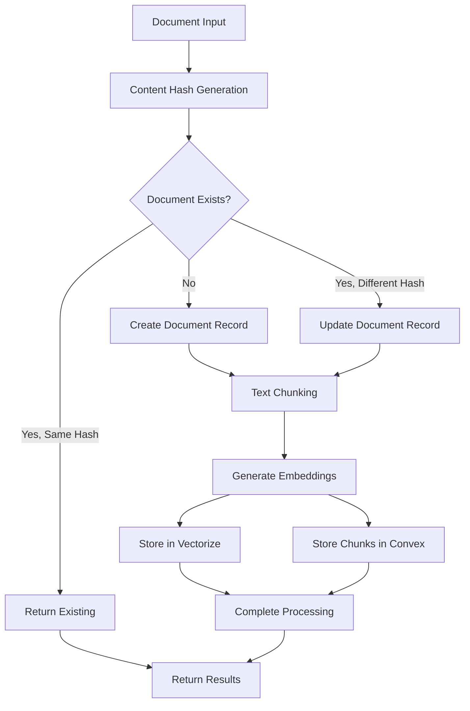

# Data Models

This schema is defined in DBML (Database Markup Language) and can be visualized at dbdiagram.io.

```dbml
// DBML for The Agentic Starter Template
// Generated for visualization on dbdiagram.io

Table users {
  _id id [primary key]
  name string
  email string [unique, not null]
  profile_image_url string [note: 'Optional URL for user avatar']
  role string [not null, default: '"user"']
  _creationTime timestamp
}

Table chat_sessions {
  _id id [primary key]
  user_id id [not null]
  title string [note: 'Can be auto-generated from the first message']
  _creationTime timestamp
}

Table chat_messages {
  _id id [primary key]
  session_id id [not null]
  user_id id [not null, note: 'Denormalized for easier querying of user messages']
  role string [not null, note: '"user" or "assistant"']
  content text [not null]
  _creationTime timestamp
}

Table log_entries {
  _id id [primary key]
  correlation_id string [not null]
  user_id id [note: 'Nullable, for system/agent logs']
  level string [not null, note: '"INFO", "WARN", "ERROR", "DEBUG"']
  message text [not null]
  source string [not null, note: '"client", "worker", "convex", "agent"']
  context object [note: 'Flexible field for additional structured data']
  _creationTime timestamp
}

// Knowledge Ingestion Tables (Story 4.2)
Table source_documents {
  _id id [primary key]
  file_path string [unique, not null, note: 'Relative path from project root']
  file_type string [not null, note: 'markdown, typescript, javascript, etc.']
  content_hash string [not null, note: 'SHA-256 hash for change detection']
  last_processed timestamp [not null]
  chunk_count number [not null, default: 0]
  processing_status string [not null, note: '"pending", "processing", "completed", "failed"']
  error_message string [note: 'Populated on processing failure']
  correlation_id string [not null, note: 'For tracing processing requests']
  _creationTime timestamp
}

Table document_chunks {
  _id id [primary key]
  source_document string [not null, note: 'References source_documents.file_path']
  chunk_index number [not null, note: 'Sequential index within document']
  content text [not null, note: 'Text chunk content for retrieval']
  chunk_hash string [not null, note: 'SHA-256 hash for deduplication']
  vectorize_id string [not null, note: 'ID in Cloudflare Vectorize (max 64 bytes)']
  metadata object [not null, note: 'File metadata: path, type, modified_at, chunk_size']
  created_at timestamp [not null]
  correlation_id string [not null]
  _creationTime timestamp
}

// --- Relationships ---
Ref: users._id < chat_sessions.user_id
Ref: chat_sessions._id < chat_messages.session_id
Ref: users._id < chat_messages.user_id
Ref: users._id < log_entries.user_id
Ref: source_documents.file_path < document_chunks.source_document
```

## Vector Storage Architecture (Story 4.2)

### Hybrid Data Storage Pattern

The Knowledge Ingestion Service implements a **hybrid data storage pattern** that combines Convex database storage with Cloudflare Vectorize for optimal performance and functionality:

#### 1. **Convex Database Storage**
- **source_documents**: Document metadata, processing status, and change detection
- **document_chunks**: Text chunk content, metadata, and references to vector storage
- **Purpose**: Fast metadata queries, content retrieval, and operational state management

#### 2. **Cloudflare Vectorize Storage**
- **Vector embeddings**: 1536-dimension embeddings from OpenAI text-embedding-3-small
- **Vector metadata**: Source document references and chunk information
- **Purpose**: High-performance similarity search and vector operations

### Key Design Decisions

#### **Vector ID Management**
```typescript
// Generate unique vectorize ID (max 64 bytes for Vectorize)
// Use first 16 chars of content hash + chunk index to stay under limit
const shortHash = contentHash.substring(0, 16);
const vectorizeId = `${shortHash}_c${chunk.index}`;
```

**Rationale**: Cloudflare Vectorize has a strict 64-byte limit on vector IDs. Using a shortened hash ensures uniqueness while staying within limits.

#### **Content Hash-Based Change Detection**
```typescript
const contentHash = crypto
  .createHash('sha256')
  .update(args.content)
  .digest('hex');
```

**Rationale**: Enables efficient deduplication and incremental processing. Documents are only reprocessed when content actually changes.

#### **Graceful Degradation**
- **Missing OpenAI API Key**: Processing continues with placeholder embeddings
- **Missing Vectorize Config**: Chunks stored in Convex with placeholder vector IDs
- **API Failures**: Document processing completes even if vector insertion fails

### Data Flow Architecture



### Vector Storage Specifications

#### **Cloudflare Vectorize Configuration**
- **Database Name**: `starter-nextjs-convex-ai-knowledge`
- **Dimensions**: 1536 (compatible with OpenAI text-embedding-3-small)
- **Metric**: Cosine similarity
- **API Version**: v2 (critical - v1 does not work reliably)
- **Vector ID Limit**: 64 bytes maximum

#### **Embedding Configuration**
- **Model**: OpenAI text-embedding-3-small
- **Chunk Size**: Configurable via `DEFAULT_CHUNKING_CONFIG`
- **Overlap**: Configurable chunk overlap for context preservation
- **Cost Optimization**: text-embedding-3-small chosen for cost-effectiveness

### Query and Retrieval Patterns

#### **Similarity Search Flow**
1. **Query Embedding**: Generate embedding for search query
2. **Vector Search**: Query Vectorize for similar vectors with metadata
3. **Content Retrieval**: Fetch full chunk content from Convex using vectorize_id
4. **Result Assembly**: Combine vector scores with chunk content and metadata

#### **Performance Considerations**
- **Metadata-Only Queries**: Option to skip content retrieval for faster responses
- **TopK Limiting**: Configurable result limits for performance
- **Async Processing**: Non-blocking vector insertion with fallback handling

### Indexing Strategy

#### **Convex Indexes**
```typescript
// Efficient lookups for document management
.index('by_file_path', ['file_path'])
.index('by_content_hash', ['content_hash'])
.index('by_vectorize_id', ['vectorize_id'])
.index('by_source_document', ['source_document'])
```

#### **Vectorize Metadata Schema**
```typescript
metadata: {
  source_document: string,
  chunk_index: number,
  file_path: string,
  file_type: string,
  chunk_size: number,
  content_preview: string, // First 100 chars for debugging
}
```

### Scalability and Maintenance

#### **Cleanup Patterns**
- **Document Deletion**: Coordinated cleanup across Convex and Vectorize
- **Orphan Prevention**: Transaction-like operations to maintain consistency
- **Change Detection**: Hash-based processing only when content changes

#### **Monitoring and Observability**
- **Correlation IDs**: End-to-end tracing through processing pipeline
- **Processing Status**: Detailed status tracking in source_documents table
- **Vector Insertion Logging**: Comprehensive logging for debugging vector operations

This architecture provides a robust foundation for AI-powered document search while maintaining high performance and operational visibility.
