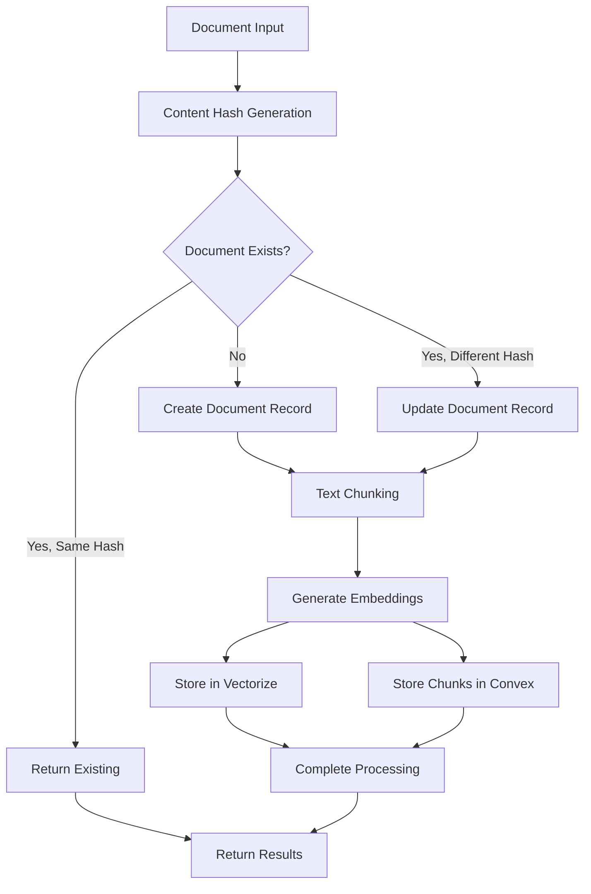

# Data Models

**Source of Truth**: This documentation is generated from the actual Convex schema at `apps/convex/schema.ts`.

> **🔄 Dynamic Documentation**: This file reflects the current database schema with detailed annotations from the source code. For the most up-to-date structure, refer to the executable schema file.

## Schema Overview

The database follows a **multi-layer AI-first application architecture** with the following key patterns:

- **BetterAuth Integration**: Comprehensive authentication with sessions and OAuth support
- **Hybrid Vector Storage**: Convex metadata + Cloudflare Vectorize for AI-powered search
- **Multi-System Logging**: Centralized debugging across browser, server, and worker layers
- **Real-time Chat**: Persistent conversations with AI usage tracking
- **Knowledge Ingestion**: Document processing pipeline with vector embeddings

## DBML Schema Visualization

This schema can be visualized at [dbdiagram.io](https://dbdiagram.io) using the following DBML:

```dbml
// DBML for Starter Next.js Convex AI Template
// Auto-generated from apps/convex/schema.ts
// Last updated: [Generated from current schema]

// =============================================================================
// TESTING & DEVELOPMENT TABLES
// =============================================================================

Table test_messages {
  _id id [primary key]
  message string [note: 'Simple test message content']
  timestamp number [note: 'Unix timestamp for message creation']
  _creationTime timestamp
}

// =============================================================================
// AUTHENTICATION & USER MANAGEMENT
// =============================================================================

Table users {
  _id id [primary key]
  name string [note: 'User display name for UI presentation']
  email string [unique, not null, note: 'Email for authentication (PII - encrypted storage)']
  password string [note: 'Bcrypt hashed password - never plaintext']
  profile_image_url string [note: 'Optional avatar URL (external storage)']
  role string [not null, note: 'Values: user, admin, moderator']
  hasLLMAccess boolean [note: 'Feature flag for AI access control']
  _creationTime timestamp
}

Table sessions {
  _id id [primary key]
  userId id [not null, note: 'Reference to authenticated user']
  sessionToken string [unique, note: 'Secure session identifier']
  expires number [note: 'Session expiration timestamp']
  rememberMe boolean [note: 'Persistent session flag']
  _creationTime timestamp
}

Table accounts {
  _id id [primary key]
  userId id [not null, note: 'Reference to linked user account']
  type string [note: 'OAuth account type: oauth, email']
  provider string [note: 'OAuth provider: github, google, etc.']
  providerAccountId string [note: 'Provider-specific account ID']
  refresh_token string [note: 'OAuth refresh token (encrypted)']
  access_token string [note: 'OAuth access token (encrypted, short-lived)']
  expires_at number [note: 'Access token expiration timestamp']
  token_type string [note: 'Token type: Bearer, token']
  scope string [note: 'OAuth scope permissions']
  id_token string [note: 'OpenID Connect ID token (JWT)']
  _creationTime timestamp
}

Table password_reset_tokens {
  _id id [primary key]
  userId id [not null, note: 'Reference to user requesting reset']
  token string [note: 'Secure reset token (high entropy, single-use)']
  expires number [note: 'Token expiration (1-24 hours)']
  _creationTime timestamp
}

// =============================================================================
// LOGGING & DEBUGGING INFRASTRUCTURE
// =============================================================================

Table debug_logs {
  _id id [primary key]
  id string [note: 'Original Redis log ID for traceability']
  trace_id string [note: 'Request/session correlation ID']
  user_id string [note: 'Optional user context (allows system logs)']
  system string [note: 'Values: browser, convex, worker, manual']
  level string [note: 'Values: log, info, warn, error']
  message string [note: 'Human-readable log message']
  timestamp number [note: 'Original event timestamp']
  context object [note: 'Structured event context (JSON)']
  stack string [note: 'Error stack trace for debugging']
  raw_data object [note: 'Complete original log entry']
  synced_at number [note: 'Redis → Convex sync timestamp']
  _creationTime timestamp
}

// =============================================================================
// CHAT & CONVERSATION SYSTEM
// =============================================================================

Table chat_sessions {
  _id id [primary key]
  userId id [not null, note: 'Session owner reference']
  title string [note: 'Auto-generated or user-provided conversation title']
  created_at number [note: 'Session creation timestamp']
  updated_at number [note: 'Last activity timestamp']
  correlation_id string [note: 'Request correlation for debugging']
  _creationTime timestamp
}

Table chat_messages {
  _id id [primary key]
  sessionId id [not null, note: 'Parent conversation session']
  userId id [not null, note: 'Message author (denormalized for performance)']
  role string [note: 'Values: user, assistant']
  content text [note: 'Message text (Markdown-supported)']
  timestamp number [note: 'Message creation timestamp']
  correlation_id string [note: 'Request correlation ID']
  model_used string [note: 'AI model for assistant messages (gpt-4, claude-3)']
  tokens_used number [note: 'Token consumption for cost tracking']
  has_llm_access boolean [note: 'LLM usage flag for analytics']
  _creationTime timestamp
}

// =============================================================================
// KNOWLEDGE INGESTION & VECTOR SEARCH SYSTEM
// =============================================================================

Table source_documents {
  _id id [primary key]
  file_path string [unique, not null, note: 'Relative path from project root']
  file_type string [note: 'Document type: markdown, typescript, etc.']
  content_hash string [note: 'SHA-256 hash for change detection']
  last_processed number [note: 'Last processing timestamp']
  chunk_count number [note: 'Total chunks generated']
  processing_status string [note: 'Values: pending, processing, completed, failed']
  error_message string [note: 'Processing error details']
  correlation_id string [note: 'Processing trace ID']
  _creationTime timestamp
}

Table document_chunks {
  _id id [primary key]
  source_document string [not null, note: 'Reference to source_documents.file_path']
  chunk_index number [note: 'Sequential position in document']
  content text [note: 'Text chunk for retrieval']
  chunk_hash string [note: 'SHA-256 hash for deduplication']
  vectorize_id string [note: 'Cloudflare Vectorize ID (max 64 bytes)']
  metadata object [note: 'Rich metadata: file_path, file_type, modified_at, chunk_size']
  created_at number [note: 'Chunk creation timestamp']
  correlation_id string [note: 'Processing trace ID']
  _creationTime timestamp
}

// --- Relationships ---
// Authentication relationships
Ref: users._id < sessions.userId
Ref: users._id < accounts.userId
Ref: users._id < password_reset_tokens.userId

// Chat relationships
Ref: users._id < chat_sessions.userId
Ref: chat_sessions._id < chat_messages.sessionId
Ref: users._id < chat_messages.userId [note: 'Denormalized for performance']

// Knowledge system relationships
Ref: source_documents.file_path < document_chunks.source_document

// Note: debug_logs table has no foreign key relationships (standalone logging)
```

## Vector Storage Architecture (Story 4.2)

### Hybrid Data Storage Pattern

The Knowledge Ingestion Service implements a **hybrid data storage pattern** that combines Convex database storage with Cloudflare Vectorize for optimal performance and functionality:

#### 1. **Convex Database Storage**

- **source_documents**: Document metadata, processing status, and change detection
- **document_chunks**: Text chunk content, metadata, and references to vector storage
- **Purpose**: Fast metadata queries, content retrieval, and operational state management

#### 2. **Cloudflare Vectorize Storage**

- **Vector embeddings**: 1536-dimension embeddings from OpenAI text-embedding-3-small
- **Vector metadata**: Source document references and chunk information
- **Purpose**: High-performance similarity search and vector operations

### Key Design Decisions

#### **Vector ID Management**

```typescript
// Generate unique vectorize ID (max 64 bytes for Vectorize)
// Use first 16 chars of content hash + chunk index to stay under limit
const shortHash = contentHash.substring(0, 16);
const vectorizeId = `${shortHash}_c${chunk.index}`;
```

**Rationale**: Cloudflare Vectorize has a strict 64-byte limit on vector IDs. Using a shortened hash ensures uniqueness while staying within limits.

#### **Content Hash-Based Change Detection**

```typescript
const contentHash = crypto
  .createHash('sha256')
  .update(args.content)
  .digest('hex');
```

**Rationale**: Enables efficient deduplication and incremental processing. Documents are only reprocessed when content actually changes.

#### **Graceful Degradation**

- **Missing OpenAI API Key**: Processing continues with placeholder embeddings
- **Missing Vectorize Config**: Chunks stored in Convex with placeholder vector IDs
- **API Failures**: Document processing completes even if vector insertion fails

### Data Flow Architecture



### Vector Storage Specifications

#### **Cloudflare Vectorize Configuration**

- **Database Name**: `starter-nextjs-convex-ai-knowledge`
- **Dimensions**: 1536 (compatible with OpenAI text-embedding-3-small)
- **Metric**: Cosine similarity
- **API Version**: v2 (critical - v1 does not work reliably)
- **Vector ID Limit**: 64 bytes maximum

#### **Embedding Configuration**

- **Model**: OpenAI text-embedding-3-small
- **Chunk Size**: Configurable via `DEFAULT_CHUNKING_CONFIG`
- **Overlap**: Configurable chunk overlap for context preservation
- **Cost Optimization**: text-embedding-3-small chosen for cost-effectiveness

### Query and Retrieval Patterns

#### **Similarity Search Flow**

1. **Query Embedding**: Generate embedding for search query
2. **Vector Search**: Query Vectorize for similar vectors with metadata
3. **Content Retrieval**: Fetch full chunk content from Convex using vectorize_id
4. **Result Assembly**: Combine vector scores with chunk content and metadata

#### **Performance Considerations**

- **Metadata-Only Queries**: Option to skip content retrieval for faster responses
- **TopK Limiting**: Configurable result limits for performance
- **Async Processing**: Non-blocking vector insertion with fallback handling

### Indexing Strategy

#### **Convex Indexes**

```typescript
// Efficient lookups for document management
.index('by_file_path', ['file_path'])
.index('by_content_hash', ['content_hash'])
.index('by_vectorize_id', ['vectorize_id'])
.index('by_source_document', ['source_document'])
```

#### **Vectorize Metadata Schema**

```typescript
metadata: {
  source_document: string,
  chunk_index: number,
  file_path: string,
  file_type: string,
  chunk_size: number,
  content_preview: string, // First 100 chars for debugging
}
```

### Scalability and Maintenance

#### **Cleanup Patterns**

- **Document Deletion**: Coordinated cleanup across Convex and Vectorize
- **Orphan Prevention**: Transaction-like operations to maintain consistency
- **Change Detection**: Hash-based processing only when content changes

#### **Monitoring and Observability**

- **Correlation IDs**: End-to-end tracing through processing pipeline
- **Processing Status**: Detailed status tracking in source_documents table
- **Vector Insertion Logging**: Comprehensive logging for debugging vector operations

This architecture provides a robust foundation for AI-powered document search while maintaining high performance and operational visibility.
