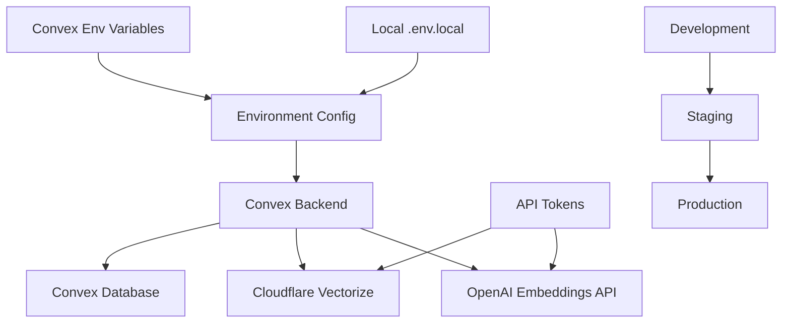

# Knowledge Ingestion Service Deployment Patterns

**Epic**: 4 - AI-Powered Chat Interface  
**Story**: 4.2 - Knowledge Ingestion Service  
**Implementation Date**: 2025-01-26

## Overview

This document captures deployment lessons learned from implementing the Knowledge Ingestion Service with Cloudflare Vectorize integration, focusing on configuration management, environment synchronization, and operational patterns.

## Deployment Architecture

### Multi-Service Coordination

The Knowledge Ingestion Service requires coordination between multiple services:



### Critical Dependencies

1. **OpenAI API** - Embedding generation (optional with graceful degradation)
2. **Cloudflare Vectorize** - Vector storage (optional with graceful degradation)
3. **Convex Database** - Metadata and content storage (required)

## Environment Configuration Patterns

### 1. Graceful Degradation Pattern

**Implementation**: Service functions even with partial configuration

```typescript
// ✅ Robust configuration handling
export function createVectorizeClient(config: VectorizeConfig): VectorizeClient | null {
  if (!config.accountId || !config.apiToken || !config.databaseId) {
    console.warn('Vectorize configuration incomplete - vector operations will be disabled');
    return null;
  }
  return new VectorizeClient(config);
}

// ✅ Graceful OpenAI API handling
if (config.llm.openAiApiKey) {
  try {
    const embeddingResults = await generateEmbeddingsForChunks(textChunks, config.llm.openAiApiKey);
    chunksWithEmbeddings = embeddingResults;
  } catch (error) {
    console.error('Failed to generate embeddings:', error);
    // Fallback to placeholder embeddings
    chunksWithEmbeddings = textChunks.map(chunk => ({ chunk, embedding: null }));
  }
} else {
  console.warn('OpenAI API key not configured - skipping embedding generation');
}
```

### 2. Environment Variable Management

#### Development Environment (.env.local)
```env
# Required for LLM functionality
OPENROUTER_API_KEY=sk-or-v1-...

# Optional - Embedding generation
OPENAI_API_KEY=sk-...

# Optional - Vector storage
CLOUDFLARE_ACCOUNT_ID=0b17338a29a5133808f6783d3666ecc5
CLOUDFLARE_API_TOKEN=B5wCJK3jgRaA-4q9S0JhDSCg6w-9m3W_v27a6kUE
VECTORIZE_DATABASE_ID=starter-nextjs-convex-ai-knowledge
```

#### Production Environment (Convex Dashboard)
```bash
# Set via Convex CLI or dashboard
npx convex env set OPENROUTER_API_KEY sk-or-v1-...
npx convex env set OPENAI_API_KEY sk-...
npx convex env set CLOUDFLARE_ACCOUNT_ID 0b17338a29a5133808f6783d3666ecc5
npx convex env set CLOUDFLARE_API_TOKEN B5wCJK3jgRaA-4q9S0JhDSCg6w-9m3W_v27a6kUE
npx convex env set VECTORIZE_DATABASE_ID starter-nextjs-convex-ai-knowledge
```

### 3. Configuration Validation Pattern

```typescript
export function validateConfig(config: AppConfig): void {
  // Check required LLM configuration
  if (!config.llm.openRouterApiKey) {
    throw new Error('OpenRouter API key is required');
  }
  
  // Warn about missing optional configuration
  if (!config.vectorize.accountId || !config.vectorize.apiToken) {
    console.warn('Vectorize configuration incomplete - vector storage will use placeholders');
  }
  
  if (!config.llm.openAiApiKey) {
    console.warn('OpenAI API key not configured - embedding generation will be skipped');
  }
}
```

## Deployment Lessons Learned

### 1. API Version Criticality

**Issue**: Initial implementation used Vectorize API v1
```typescript
// ❌ Original implementation - unreliable
const baseUrl = `https://api.cloudflare.com/client/v4/accounts/${accountId}/vectorize/v1/indexes/${databaseId}`;
```

**Solution**: Migration to API v2
```typescript
// ✅ Fixed implementation - stable
const baseUrl = `https://api.cloudflare.com/client/v4/accounts/${accountId}/vectorize/v2/indexes/${databaseId}`;
```

**Impact**: 
- v1 had inconsistent authentication behavior
- v2 provides reliable vector operations
- Migration required careful testing to ensure compatibility

### 2. Vector ID Length Constraints

**Issue**: Initial vector IDs exceeded 64-byte limit
```typescript
// ❌ Original approach - too long
const vectorizeId = `${fullDocumentPath}_${contentHash}_chunk_${chunkIndex}_${timestamp}`;
```

**Solution**: Optimized ID generation
```typescript
// ✅ Optimized approach - under 64 bytes
const shortHash = contentHash.substring(0, 16);
const vectorizeId = `${shortHash}_c${chunkIndex}`;
```

**Implementation Pattern**:
```typescript
// Validate ID length before insertion
if (vectorizeId.length > 64) {
  throw new Error(`Vector ID exceeds 64 byte limit: ${vectorizeId} (${vectorizeId.length} bytes)`);
}
```

### 3. Environment Synchronization Workflow

**Challenge**: User-specific environment sync process

**User's Custom Workflow**:
1. Updates local `.env.local` file
2. Runs custom sync script to update Convex environment
3. Verifies configuration through development testing

**Deployment Pattern**:
```bash
# Custom environment sync workflow
# 1. Update local .env.local
# 2. Sync to Convex (user has custom process)
# 3. Verify configuration
bunx convex run knowledgeActions:addDocument '{
  "content": "Configuration test",
  "source": "config-test.md"
}'
```

### 4. Database Naming Strategy

**Lesson**: Use project-specific database names

```typescript
// ✅ Recommended naming pattern
const databaseId = `${projectName}-knowledge`;
// Example: "starter-nextjs-convex-ai-knowledge"

// ❌ Avoid generic names
const databaseId = "knowledge-base"; // Risk of conflicts
```

**Rationale**:
- Prevents conflicts in multi-project environments
- Easier to identify in Cloudflare dashboard
- Supports environment-specific databases

## Operational Patterns

### 1. Change Detection and Incremental Processing

**Pattern**: Hash-based change detection
```typescript
const contentHash = crypto.createHash('sha256').update(args.content).digest('hex');

const existingDoc = await ctx.runQuery(api.knowledgeMutations.getDocumentByPath, {
  filePath: args.source,
});

if (existingDoc && existingDoc.content_hash === contentHash) {
  return {
    documentId: existingDoc._id,
    chunksCreated: existingDoc.chunk_count,
    status: 'already_exists',
  };
}
```

**Benefits**:
- Avoids reprocessing unchanged documents
- Reduces API costs for embeddings
- Improves processing performance

### 2. Correlation ID Tracing

**Pattern**: End-to-end request tracing
```typescript
const correlationId = crypto.randomUUID();

// Used throughout processing pipeline
await ctx.runMutation(internal.knowledgeMutations.createOrUpdateDocument, {
  filePath: args.source,
  contentHash,
  correlationId,
});
```

**Benefits**:
- Enables debugging of complex processing workflows
- Tracks operations across multiple services
- Facilitates log analysis and troubleshooting

### 3. Batch Processing Strategy

**Pattern**: Batch vector insertions
```typescript
// Prepare all vectors before insertion
const vectorsToInsert: VectorizeVector[] = [];

for (const chunkWithEmbedding of chunksWithEmbeddings) {
  if (embedding && vectorizeClient) {
    vectorsToInsert.push({
      id: vectorizeId,
      values: embedding,
      metadata: chunkMetadata,
    });
  }
}

// Single batch insertion
if (vectorsToInsert.length > 0 && vectorizeClient) {
  const insertResult = await vectorizeClient.insertVectors(vectorsToInsert);
}
```

**Benefits**:
- Reduces API call overhead
- Improves performance for large documents
- Atomic operations for consistency

## Error Handling and Recovery

### 1. Service Degradation Handling

```typescript
// Vector insertion failure doesn't block document processing
try {
  const insertResult = await vectorizeClient.insertVectors(vectorsToInsert);
  console.log(`Successfully inserted vectors: mutation ${insertResult.mutationId}`);
} catch (error) {
  console.error('Failed to insert vectors into Vectorize:', error);
  // Continue processing - we'll store metadata even if vector insertion fails
}

// Always store chunk metadata in Convex
for (const chunkData of chunksToStore) {
  await ctx.runMutation(internal.knowledgeMutations.createDocumentChunk, chunkData);
}
```

### 2. Configuration Validation at Runtime

```typescript
// Test Vectorize connection before processing
const vectorizeClient = createVectorizeClient(config.vectorize);
if (vectorizeClient) {
  const connectionTest = await vectorizeClient.testConnection();
  if (!connectionTest) {
    console.warn('Vectorize connection failed - falling back to metadata-only storage');
  }
}
```

## Security and Access Control

### 1. API Token Management

**Pattern**: Minimal privilege principle
```env
# API token with minimal required permissions
# - Account:Cloudflare Workers:Edit (for Vectorize)
# - Account:Account:Read (for account access)
CLOUDFLARE_API_TOKEN=token-with-minimal-scope
```

### 2. Environment Variable Security

**Development**:
- Store in `.env.local` (gitignored)
- Never commit secrets to repository

**Production**:
- Use Convex environment variables
- Rotate API tokens regularly
- Monitor for unauthorized access

## Performance Optimization

### 1. Embedding Model Selection

**Choice**: OpenAI text-embedding-3-small
- **Cost**: $0.00002 per 1K tokens
- **Dimensions**: 1536
- **Performance**: Good balance of cost and quality

**Alternative Considerations**:
- text-embedding-3-large: Higher quality, higher cost
- text-embedding-ada-002: Legacy option, similar performance

### 2. Chunking Strategy

**Configuration**:
```typescript
export const DEFAULT_CHUNKING_CONFIG = {
  maxChunkSize: 1000,
  chunkOverlap: 200,
  preserveCodeBlocks: true,
  preserveMarkdownStructure: true,
};
```

**Rationale**:
- Balance between context preservation and processing efficiency
- Overlap ensures context continuity
- Structure preservation improves retrieval quality

## Monitoring and Observability

### 1. Processing Statistics

**Pattern**: Detailed logging and metrics
```typescript
console.log(`Processing document ${args.source}: ${calculateTextStats(args.content).wordCount} words`);
console.log(`Created ${textChunks.length} chunks for document ${args.source}`);
console.log(`Successfully inserted vectors: mutation ${insertResult.mutationId}, count: ${insertResult.count}`);
```

### 2. Error Tracking

**Pattern**: Comprehensive error context
```typescript
catch (error) {
  console.error('Error processing document:', error);
  throw new ConvexError(`Failed to process document: ${(error as Error).message}`);
}
```

## Deployment Checklist

### Pre-Deployment Validation
- [ ] All environment variables configured
- [ ] API tokens have correct permissions
- [ ] Database names follow naming conventions
- [ ] API version is v2 for Vectorize
- [ ] Vector ID generation stays under 64 bytes

### Post-Deployment Verification
- [ ] Test document processing with sample content
- [ ] Verify vector insertion logs show success
- [ ] Check database population in Convex dashboard
- [ ] Test similarity search functionality
- [ ] Monitor error rates and performance metrics

### Rollback Procedures
- [ ] Identify configuration changes for rollback
- [ ] Document vector cleanup procedures
- [ ] Prepare database migration scripts if needed
- [ ] Test degraded service modes

This deployment pattern documentation ensures reliable and maintainable Knowledge Ingestion Service deployments across development, staging, and production environments.