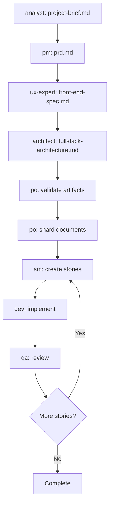

# BMAD Methodology Overview

## Introduction

The **BMAD (Before, Model, After, Document) Methodology** is an integrated system for agentic software development that transforms how developers direct AI agents to build robust, maintainable applications. This starter template includes a complete BMAD implementation designed to accelerate development through systematic AI workforce management.

## Daily Development Workflow

### Your Standard Story Implementation Process

This is the typical workflow you follow for each story implementation:

#### 1. Create Story Draft

Start with the Story Manager to create a new user story:

```bash
@sm *create                    # Create next user story from sharded PRD
```

#### 2. Validate Story Draft (Optional but Recommended)

Before implementation, validate the story has proper acceptance criteria:

```bash
@po *validate-story-draft      # Ensure story is ready for development
```

#### 3. Switch to Developer and Implement

Change to the developer agent and implement the story:

```bash
@dev                          # Activate developer agent
# Implement the story following acceptance criteria
```

#### 4. Test and UAT

After implementation, generate UAT plan for user acceptance testing:

```bash
# Option 1: Developer offers UAT generation at story completion
# Dev agent will ask: "Would you like me to generate a UAT plan?"

# Option 2: Generate UAT plan manually
@qa *generate-uat             # Generate user-focused UAT plan
# Creates UAT plan with URLs, user actions, and visual verification only
```

#### 5. Backpropagate Documentation

Use the KDD agent to update documentation based on what was learned:

```bash
@kdd *update-documentation    # Knowledge-driven development documentation update
@kdd *capture-learnings       # Document implementation insights
```

### Quick Command Reference

| Command                      | Purpose                        | Agent |
| ---------------------------- | ------------------------------ | ----- |
| `@sm *create`                | Create next user story         | SM    |
| `@po *validate-story-draft`  | Validate story quality         | PO    |
| `@dev`                       | Implement story                | Dev   |
| `@qa *generate-uat`          | Generate user-focused UAT plan | QA    |
| `@kdd *update-documentation` | Update docs with learnings     | KDD   |

## Core Philosophy

BMAD operates on the principle that in the age of AI development, the primary bottleneck is not writing code, but effectively directing AI agents to build production-quality applications. The methodology provides:

- **Context Engineering**: Systematic approaches to providing AI agents with rich, structured context
- **Workflow Orchestration**: Defined sequences for complex software development tasks
- **Quality Assurance**: Built-in validation and review processes
- **Documentation-Driven Development**: Self-documenting workflows that improve over time

## System Architecture

### Agent Ecosystem

The BMAD system includes 8 specialized AI agents, each with defined personas and capabilities:

| Agent                | Role                         | Primary Functions                                             |
| -------------------- | ---------------------------- | ------------------------------------------------------------- |
| **Analyst** 📊       | Business Analyst             | Project briefs, market research, brainstorming                |
| **PM** 📋            | Product Manager              | PRDs, requirements management, story prioritization           |
| **UX Expert** 🎨     | UX/UI Designer               | Frontend specifications, user research, design systems        |
| **Architect** 🏗️     | Solution Architect           | Technical architecture, system design, technology decisions   |
| **Product Owner** 📝 | Product Owner                | Backlog management, story validation, process stewardship     |
| **Dev** 💻           | Senior Developer             | Implementation, code review, technical execution              |
| **QA** 🔍            | Quality Assurance            | Testing, code review, quality validation                      |
| **KDD** 📚           | Knowledge-Driven Development | Documentation updates, learning capture, knowledge management |

### Workflow Types

**Greenfield Development**: Complete application development from concept to deployment

- Full-stack applications
- Frontend-only projects
- Backend/API services
- Rapid prototypes and MVPs

**Brownfield Development**: Feature addition and enhancement for existing codebases

- Epic creation for complex features
- Story-driven development
- Incremental improvements

## Command-Line Interface

### Agent Activation

Agents are activated using the `@agent-name` syntax:

```bash
@sm              # Activate Story Manager
@po              # Activate Product Owner
@architect       # Activate Solution Architect
@dev             # Activate Developer
@qa              # Activate QA Engineer
@kdd             # Activate Knowledge-Driven Development
```

### Agent Commands

Each agent supports specific commands prefixed with `*`:

```bash
@sm *create                  # Create next user story
@po *validate-story-draft    # Validate story quality before development
@po *execute-checklist       # Run quality validation
@po *shard-doc docs/prd.md   # Split document for AI consumption
@qa *generate-uat            # Generate user-focused UAT plan
@qa *review                  # Review implementation against acceptance criteria
@kdd *update-documentation   # Update documentation with learnings
@kdd *capture-learnings      # Document implementation insights
```

### Slash Commands

Specialized tasks available via slash commands:

```bash
/create-next-story          # Generate sequential user story
/shard-doc                  # Split large documents
/facilitate-brainstorming-session  # Structured ideation
/advanced-elicitation       # Deep requirements gathering
/review-story              # Validate story completeness
```

## Development Workflows

### Greenfield Full-Stack Workflow



### Story Development Cycle

1. **Story Creation**: `@sm *create` generates next story from sharded PRD
2. **Implementation**: `@dev` implements with full architectural context
3. **Quality Review**: `@qa` validates implementation and provides feedback
4. **Iteration**: Continue until all epic stories complete

### Agent Responsibilities for Story Management

| Agent  | Focus                       | Story Creation         | Best For                    |
| ------ | --------------------------- | ---------------------- | --------------------------- |
| **SM** | Sequential story generation | Primary responsibility | Creating next logical story |
| **PO** | Validation & oversight      | Secondary capability   | Reviewing story quality     |

**Recommendation**: Use `@sm *create` for story creation, then optionally `@po *validate-story-draft` for quality assurance before development.

## Document Management

### Template System

BMAD includes comprehensive templates for:

- **project-brief-tmpl.yaml**: Executive summary and vision
- **prd-tmpl.yaml**: Product requirements and epics
- **front-end-spec-tmpl.yaml**: UI/UX specifications
- **fullstack-architecture-tmpl.yaml**: Technical architecture
- **story-tmpl.yaml**: User story structure

### Document Sharding

Large documents are automatically split into digestible chunks for AI consumption:

```bash
@po *shard-doc docs/prd.md docs/prd/
```

Creates:

- `docs/prd/index.md` - Overview and navigation
- `docs/prd/epic-1.md` - Individual epic details
- `docs/prd/epic-2.md` - Sequential epic breakdown

### Quality Assurance

Built-in checklists ensure completeness:

- **architect-checklist.md**: Technical architecture validation
- **story-draft-checklist.md**: User story quality verification
- **po-master-checklist.md**: Overall project coherence

## Integration with This Template

### Project Stack Alignment

The BMAD system is pre-configured for this template's technology stack:

- **Next.js** (App Router) with TypeScript
- **Convex** for backend and real-time features
- **Tailwind CSS** + **ShadCN UI** for styling
- **Cloudflare** Pages/Workers for edge deployment
- **Bun** as the package manager

### Development Commands Integration

BMAD workflows integrate with the project's development commands:

```bash
bun dev              # Start development server
bun test             # Run tests after implementation
bun lint             # Code quality validation
bun typecheck        # TypeScript validation
bunx convex dev      # Backend development
```

### Claude Code Permissions

The system includes pre-configured permissions for seamless operation:

```json
{
  "permissions": {
    "allow": [
      "Bash(git commit:*)",
      "Bash(git push:*)",
      "Bash(git add:*)",
      "Bash(npx bmad:*)"
    ]
  }
}
```

## Getting Started

### 1. Initialize Your Project

Your project brief is already complete. Next steps:

```bash
@pm                  # Activate Product Manager
*create-doc prd      # Generate PRD from project brief
```

### 2. Create Architecture

```bash
@ux-expert           # Create frontend specification
@architect           # Design full-stack architecture
```

### 3. Begin Development

```bash
@po *shard-doc docs/prd.md docs/prd/    # Prepare for development
@sm *create                             # Create first user story
@dev                                    # Begin implementation
```

## Advanced Features

### AI Frontend Generation

The workflow supports integration with AI UI generators:

```bash
@ux-expert *generate-ai-frontend-prompt  # Create v0/Lovable prompt
# User generates UI in external tool
@architect                               # Incorporate generated structure
```

### Brownfield Enhancement

For existing codebases:

```bash
@po *create-epic        # Define new feature epic
@po *create-story       # Add stories to existing project
```

### Quality Validation

Continuous quality assurance:

```bash
@po *execute-checklist architect-checklist     # Validate architecture
@qa *review-story                              # Review implementation
```

## Benefits for Agentic Development

1. **Reduced Context Switching**: Agents maintain specialized focus areas
2. **Systematic Quality**: Built-in validation prevents downstream issues
3. **Scalable Complexity**: Handle enterprise-grade applications systematically
4. **Documentation-First**: Self-improving knowledge base
5. **Rapid Iteration**: Structured workflows accelerate development cycles

## Future Enhancements

The BMAD system is designed for extensibility:

- **Multi-Model Support**: Adapt instruction sets for different AI models
- **Custom Workflows**: Create domain-specific development patterns
- **Integration Hooks**: Connect with external tools and services
- **Analytics**: Track development velocity and quality metrics

## References

- **Core Configuration**: `.bmad-core/core-config.yaml`
- **Workflow Definitions**: `.bmad-core/workflows/`
- **Agent Personas**: `.bmad-core/agents/`
- **Task Library**: `.bmad-core/tasks/`
- **Template System**: `.bmad-core/templates/`
- **Quality Checklists**: `.bmad-core/checklists/`

---

_This methodology represents a foundational approach to Context Engineering, enabling developers to effectively direct AI agents in building production-quality software systems._
