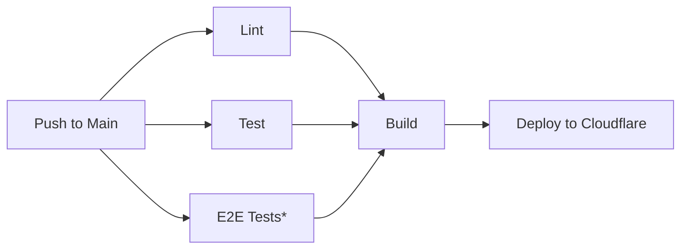

# CI/CD Pipeline Setup Guide

## Overview

This guide provides step-by-step instructions for setting up a complete GitHub Actions CI/CD pipeline with automated Cloudflare Pages deployment. Based on real implementation experience and comprehensive troubleshooting.

⚡ **What You'll Get**: Automated pipeline that runs linting, testing, building, and deployment on every push to main branch.

⏱️ **Expected Time**: 30-60 minutes (depending on API token creation experience)

🎯 **Difficulty**: Intermediate (requires GitHub, Cloudflare, and Convex account access)

## Prerequisites

Before starting, ensure you have:

- ✅ **GitHub repository** with admin access and Actions enabled
- ✅ **Cloudflare account** with Pages access
- ✅ **Convex project** set up and running locally
- ✅ **Local development environment** with project working
- ✅ **Bun/Node.js** installed locally for testing

## Pipeline Architecture

The CI/CD pipeline includes these stages:



**Jobs Overview**:

1. **Lint**: ESLint validation across monorepo
2. **Test**: Unit tests + TypeScript type checking
3. **E2E Tests**: Playwright tests (conditional - runs if tests exist)
4. **Build**: Next.js production build + Cloudflare Pages adaptation
5. **Deploy**: Automated deployment to Cloudflare Pages (main branch only)

---

## Step 1: Verify GitHub Actions Workflow

The CI/CD pipeline should already be implemented in your repository. Verify it exists:

```bash
# Check if workflow file exists
ls -la .github/workflows/ci.yml
```

If the file doesn't exist, you need to implement the workflow first (see Story 1.6 implementation).

**Expected workflow features**:

- ✅ Triggers on push to main branch and pull requests
- ✅ 5 jobs: lint, test, test-e2e, build, deploy
- ✅ Proper job dependencies (build waits for lint/test)
- ✅ Conditional deployment (main branch only)
- ✅ Environment variable support
- ✅ GitHub permissions for deployments (deployments:write)

---

## Step 2: Gather Required Information

You'll need to collect several pieces of information for GitHub Secrets. Here's what you need and where to find it:

### Required Information Checklist

- [ ] **CLOUDFLARE_API_TOKEN** (API token with Pages:Edit permission)
- [ ] **CLOUDFLARE_ACCOUNT_ID** (Your Cloudflare account identifier)
- [ ] **CLOUDFLARE_PROJECT_NAME** (Your Pages project name)
- [ ] **NEXT_PUBLIC_CONVEX_URL** (Your Convex backend URL)

---

## Step 3: Find Your Cloudflare Information

### 3.1 Find Cloudflare Account ID

**Method 1: From Domain Overview (Easiest)**

1. Go to [Cloudflare Dashboard](https://dash.cloudflare.com)
2. Click on any domain you've added to Cloudflare (e.g., `yoursite.com`)
3. On the **Overview** tab, scroll down the right sidebar
4. Look for:
   ```
   Account ID: abc123def456ghi789...
   Zone ID: xyz789abc123def456...
   ```
5. Copy the **Account ID** (not Zone ID)

**Method 2: From URL Bar**

1. When viewing any domain in Cloudflare, check your browser URL:
   ```
   https://dash.cloudflare.com/[ACCOUNT_ID]/[ZONE_ID]/...
   ```
2. The first long alphanumeric string is your Account ID

**Method 3: From API Tokens Page**

1. Go to [Cloudflare API Tokens](https://dash.cloudflare.com/profile/api-tokens)
2. Scroll down to the **API Keys** section
3. Near the Global API Key area, you should see your Account ID listed

**Method 4: API Call (If You Have an API Token)**

```bash
curl -X GET "https://api.cloudflare.com/client/v4/accounts" \
     -H "Authorization: Bearer YOUR_API_TOKEN" \
     -H "Content-Type: application/json"
```

### 3.2 Find Cloudflare Project Name

**Method 1: From Pages Dashboard**

1. Go to [Cloudflare Dashboard](https://dash.cloudflare.com)
2. Navigate to **Workers & Pages** → **Pages**
3. Look for your project in the list
4. The project name is displayed (e.g., `starter-nextjs-convex-ai`)

**Method 2: From Project URL**

1. If you're already viewing your Pages project, check the URL:
   ```
   https://dash.cloudflare.com/.../pages/view/[PROJECT_NAME]
   ```
2. The project name is in the URL path

### 3.3 Create Cloudflare API Token

1. **Go to**: [Cloudflare API Tokens](https://dash.cloudflare.com/profile/api-tokens)
2. **Click**: "Create Token"
3. **Select**: "Custom token"
4. **Configure**:

   **Token name**: `GitHub Actions Deploy`

   **Permissions**:

   ```
   Account | Cloudflare Pages | Edit
   ```

   **Account resources**:

   ```
   Include | [Your Account Name]
   ```

   **Zone resources**: (leave default or set to "Include All zones")

   **Client IP Address Filtering**: (leave empty for all addresses)

5. **Click**: "Continue to summary"
6. **Review**: Ensure it shows "Cloudflare Pages:Edit" permission
7. **Click**: "Create Token"
8. **Copy the token immediately** (you only see it once!)

**Test Your Token** (Optional):

```bash
curl -X GET "https://api.cloudflare.com/client/v4/accounts/YOUR_ACCOUNT_ID/tokens/verify" \
     -H "Authorization: Bearer YOUR_API_TOKEN" \
     -H "Content-Type: application/json"
```

Expected response:

```json
{
  "success": true,
  "errors": [],
  "messages": [],
  "result": { "id": "...", "status": "active" }
}
```

---

## Step 4: Find Your Convex URL

The build process requires your Convex backend URL for the authentication system.

**Find your Convex URL**:

```bash
# From your project root
cat apps/web/.env.local
```

Look for a line like:

```
NEXT_PUBLIC_CONVEX_URL=https://xyz123.convex.cloud
```

**If the file doesn't exist**, check:

- Your Convex dashboard for the deployment URL
- Your local development setup documentation
- Run `bunx convex dev` to see the URL in output

---

## Step 5: Configure GitHub Secrets

Now add all required secrets to your GitHub repository.

### 5.1 Access GitHub Secrets

1. Go to your GitHub repository
2. Click **"Settings"** tab (top navigation)
3. In left sidebar: **"Secrets and variables"** → **"Actions"**
4. You should see "Repository secrets" section

### 5.2 Add Required Secrets

Click **"New repository secret"** for each of these:

**Secret 1: Cloudflare API Token**

```
Name: CLOUDFLARE_API_TOKEN
Value: [paste your API token from Step 3.3]
```

**Secret 2: Cloudflare Account ID**

```
Name: CLOUDFLARE_ACCOUNT_ID
Value: [paste your Account ID from Step 3.1]
```

**Secret 3: Cloudflare Project Name**

```
Name: CLOUDFLARE_PROJECT_NAME
Value: [your project name from Step 3.2, e.g., starter-nextjs-convex-ai]
```

**Secret 4: Convex URL**

```
Name: NEXT_PUBLIC_CONVEX_URL
Value: [your Convex URL from Step 4, e.g., https://xyz123.convex.cloud]
```

### 5.3 Verify Secrets

After adding all secrets, you should see 4 secrets listed:

- CLOUDFLARE_API_TOKEN
- CLOUDFLARE_ACCOUNT_ID
- CLOUDFLARE_PROJECT_NAME
- NEXT_PUBLIC_CONVEX_URL

---

## Step 6: Test the Pipeline

### 6.1 Trigger the First Build

Make a small change to test the pipeline:

```bash
# Add a test line to README
echo "# Testing CI/CD Pipeline - $(date)" >> README.md

# Commit and push
git add README.md
git commit -m "test: trigger CI/CD pipeline"
git push origin main
```

### 6.2 Monitor the Pipeline

1. **Go to GitHub repository** → **Actions** tab
2. **Look for your workflow run** (should appear within seconds)
3. **Click on the workflow run** to see details
4. **Monitor the jobs**:
   - ✅ **Lint** (should complete in ~10s)
   - ✅ **Test** (should complete in ~12s)
   - ✅ **E2E Tests** (should skip if no tests, ~8s)
   - ✅ **Build** (should complete in ~28s)
   - ✅ **Deploy** (should complete in ~30s)

### 6.3 Verify Deployment

1. **Check the deploy job logs** for the final deployment URL
2. **Visit your Cloudflare Pages URL** to verify the site is live
3. **Confirm the change** you made appears on the site

---

## Step 7: Understanding the Pipeline

### Job Dependencies

The pipeline is designed with proper dependencies:

```
lint ─┐
      ├─► build ─► deploy
test ─┤
      │
test-e2e ─┘
```

- **lint, test, test-e2e** run in parallel
- **build** waits for lint and test to succeed
- **deploy** waits for build and test-e2e to succeed
- **deploy** only runs on main branch pushes

### Environment Variables

The pipeline uses these environment variables:

**Global (all jobs)**:

- `HUSKY=0` - Disables git hooks in CI
- `NODE_ENV=production` - Sets production environment

**Build job specific**:

- `NEXT_PUBLIC_CONVEX_URL` - Required for authentication pages

**Deploy job specific**:

- `CLOUDFLARE_API_TOKEN` - For deployment authentication
- `CLOUDFLARE_ACCOUNT_ID` - Identifies your account
- `CLOUDFLARE_PROJECT_NAME` - Specifies target project

---

## Troubleshooting

### Build Fails: Missing NEXT_PUBLIC_CONVEX_URL

**Error**: `Missing NEXT_PUBLIC_CONVEX_URL environment variable`

**Solution**:

1. Verify the secret exists in GitHub: Settings → Secrets → Actions
2. Check the secret name is exactly: `NEXT_PUBLIC_CONVEX_URL`
3. Verify the workflow file includes the environment variable in the build job

### Deploy Fails: Resource Not Accessible by Integration

**Error**: `RequestError [HttpError]: Resource not accessible by integration`

**Solution**:
The GitHub token lacks deployment permissions. Add permissions to your workflow:

```yaml
permissions:
  contents: read
  deployments: write
  pull-requests: read
```

This must be added at the top level of your `.github/workflows/ci.yml` file after the `on:` section.

### Deploy Fails: Invalid API Token

**Error**: `authentication failed` or `invalid token`

**Solutions**:

1. **Recreate API token** with correct permissions (Cloudflare Pages:Edit)
2. **Verify Account ID** matches your actual account
3. **Check token expiration** (if you set one)
4. **Test token manually**:
   ```bash
   curl -X GET "https://api.cloudflare.com/client/v4/accounts/YOUR_ACCOUNT_ID/tokens/verify" \
        -H "Authorization: Bearer YOUR_API_TOKEN"
   ```

### Deploy Fails: Project Not Found

**Error**: `project not found` or similar

**Solutions**:

1. **Verify project name** exactly matches what's in Cloudflare Pages
2. **Check project exists** in your Cloudflare account
3. **Ensure project name** in GitHub secret has no extra spaces/characters

### Lint Fails: ESLint Errors

**Error**: Various ESLint errors

**Solutions**:

1. **Run locally first**: `bun run lint` to see the same errors
2. **Fix linting issues** in your code
3. **Check ESLint configuration** is compatible

### Test Fails: Type Errors

**Error**: TypeScript compilation errors

**Solutions**:

1. **Run locally**: `bun run typecheck` to see the same errors
2. **Fix TypeScript errors** in your code
3. **Verify all dependencies** are properly installed

### Pipeline Doesn't Trigger

**Solutions**:

1. **Check GitHub Actions is enabled**: Repository Settings → Actions
2. **Verify workflow file exists**: `.github/workflows/ci.yml`
3. **Check branch protection rules** aren't blocking workflow
4. **Ensure you pushed to main branch** (not a feature branch)

---

## Testing Checklist

After setup, verify these scenarios work:

### ✅ **Basic Pipeline Test**

- [ ] Push to main triggers workflow
- [ ] All 5 jobs execute successfully
- [ ] Deployment completes to Cloudflare Pages
- [ ] Site is accessible and shows latest changes

### ✅ **Error Handling Test**

- [ ] Introduce lint error → pipeline fails at lint stage
- [ ] Fix lint error → pipeline succeeds
- [ ] Pipeline blocks deployment when CI fails

### ✅ **Branch Behavior Test**

- [ ] Create feature branch and push → deployment job skipped
- [ ] Merge to main → deployment job executes

### ✅ **Environment Test**

- [ ] Remove NEXT_PUBLIC_CONVEX_URL secret → build fails
- [ ] Restore secret → build succeeds

---

## Advanced Configuration

### Custom Build Commands

To modify build behavior, edit `.github/workflows/ci.yml`:

```yaml
- name: Build applications
  run: bun run build

- name: Build for Cloudflare Pages
  run: |
    cd apps/web
    bun run build:pages
```

### Additional Environment Variables

Add more secrets as needed:

```yaml
env:
  NEXT_PUBLIC_CONVEX_URL: ${{ secrets.NEXT_PUBLIC_CONVEX_URL }}
  CUSTOM_VAR: ${{ secrets.CUSTOM_VAR }}
```

### Notifications

Add failure notifications:

```yaml
- name: Notify on failure
  if: failure()
  uses: 8398a7/action-slack@v3
  with:
    status: failure
    text: 'CI/CD Pipeline failed'
```

---

## UAT Testing

For comprehensive testing of your CI/CD pipeline, see:

**[UAT Plan 1.6](../testing/uat-plan-1.6.md)** - Complete test cases covering all pipeline functionality

---

## Related Documentation

- **[Cloudflare Pages Setup](./cloudflare-pages-setup.md)** - Manual deployment setup
- **[Deployment Troubleshooting](./cloudflare-pages-deployment-troubleshooting.md)** - Common deployment issues
- **[Testing Infrastructure Lessons Learned](../lessons-learned/technology/testing-infrastructure-lessons-learned.md)** - Critical CI verification workflow and lessons
- **[Test Strategy and Standards](../architecture/test-strategy-and-standards.md)** - Testing standards in CI/CD context
- **[Cloudflare Pages GitHub Actions Example](../examples/cicd-deployment/cloudflare-pages-github-actions.md)** - Complete working example
- **[Development Workflow Patterns](../patterns/development-workflow-patterns.md)** - CI/CD patterns and best practices

---

## Security Notes

- **Never commit secrets** to your repository
- **Use GitHub Secrets** for all sensitive information
- **Rotate API tokens periodically** for security
- **Limit token permissions** to only what's needed (Cloudflare Pages:Edit)
- **Monitor deployment logs** for any exposed information

---

## Performance Expectations

**Typical pipeline timing**:

- **Lint**: ~11 seconds
- **Test**: ~10 seconds
- **E2E Tests**: ~9 seconds (if skipped) / ~60+ seconds (if running)
- **Build**: ~47 seconds
- **Deploy**: ~29 seconds
- **Total**: ~1m 36s for full pipeline

**Factors affecting speed**:

- Repository size
- Number of dependencies
- Test suite complexity
- Cloudflare network conditions

---

**Created**: Based on real implementation experience from Story 1.6
**Last Updated**: July 2025
**Tested With**: Bun 1.2.x, Next.js 14.2.x, GitHub Actions, Cloudflare Pages
